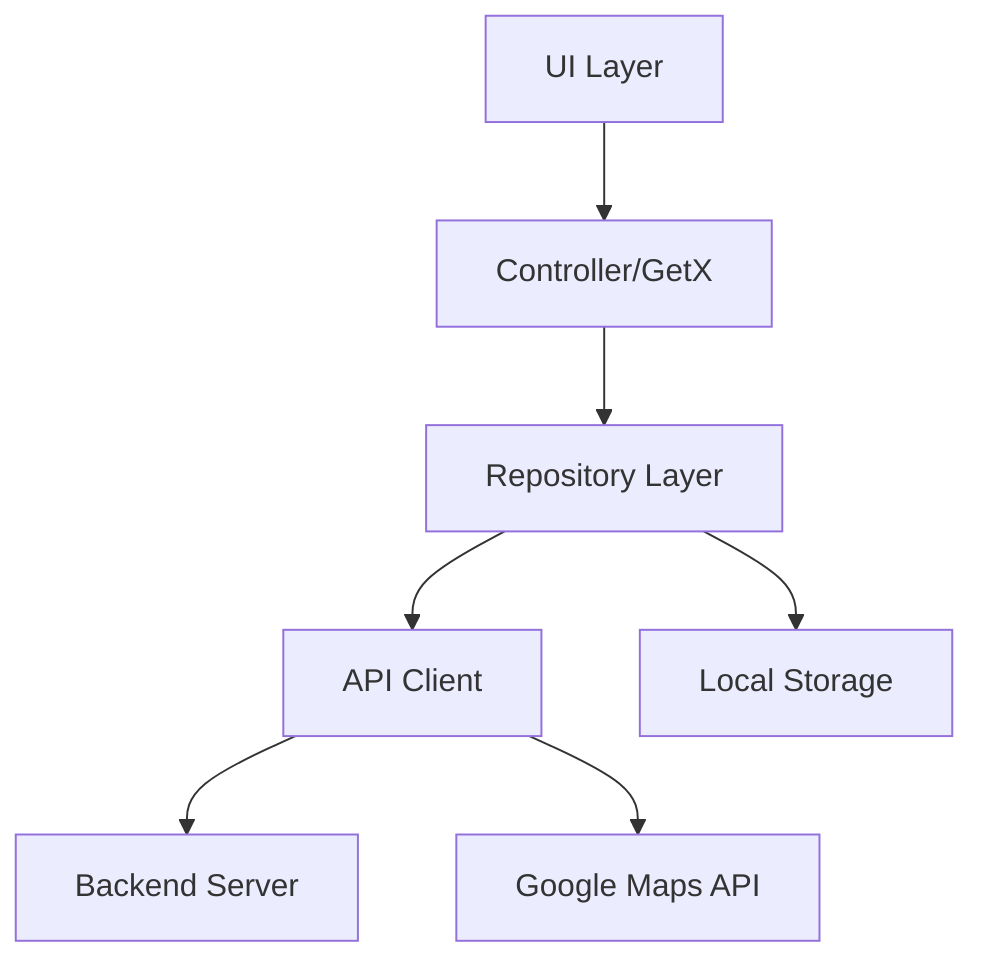

# Deep Dive Analysis - Repository Implementation Musafir App

## 1. Arsitektur dan Pattern

### Repository Pattern
Repository pattern yang diimplementasikan di Musafir App mengikuti prinsip-prinsip berikut:

1. **Separation of Concerns (SoC)**
   ```dart
   // AuthRepo memisahkan logika autentikasi dari UI dan business logic
   class AuthRepo {
     final ApiClient apiClient;
     final SharedPreferences sharedPreferences;
     // ...
   }
   ```

2. **Dependency Injection**
   ```dart
   // Konstruktor menerima dependencies dari luar
   AuthRepo({
     required this.apiClient,
     required this.sharedPreferences,
   });
   ```

3. **Single Responsibility**
   - `AuthRepo`: Menangani autentikasi
   - `GoogleRepo`: Menangani integrasi Google Maps

### Alur Data


## 2. Komponen Utama

### A. API Client Integration

#### ApiClient
```dart
// Struktur yang diharapkan dari ApiClient
class ApiClient extends GetConnect implements GetxService {
  late String token;
  final String appBaseUrl;
  late Map<String, String> _mainHeaders;

  ApiClient({required this.appBaseUrl}) {
    baseUrl = appBaseUrl;
    timeout = Duration(seconds: 30);
    _mainHeaders = {
      'Content-type': 'application/json; charset=UTF-8',
      'Authorization': 'Bearer $token',
    };
  }

  void updateHeader(String token) {
    _mainHeaders = {
      'Content-type': 'application/json; charset=UTF-8',
      'Authorization': 'Bearer $token',
    };
  }
}
```

#### Error Handling Detail
```dart
Future<Response> posData(String uri, dynamic body) async {
  try {
    Response response = await post(uri, body, headers: _mainHeaders);
    return response;
  } catch (e) {
    return Response(
      statusCode: 1,
      statusText: e.toString()
    );
  }
}
```

### B. Local Storage Management

#### SharedPreferences Implementation
```dart
// Contoh implementasi lengkap penyimpanan token
Future<bool> saveUserToken(String token) async {
  try {
    apiClient.token = token;  // Update token di API client
    apiClient.updateHeader(token);  // Update header dengan token baru
    return await sharedPreferences.setString(AppConstans.TOKEN, token);
  } catch (e) {
    print('Error saving token: $e');
    return false;
  }
}
```

#### Token Management
```dart
// Diagram alur token
sequenceDiagram
    participant U as User
    participant AR as AuthRepo
    participant AC as ApiClient
    participant SP as SharedPreferences
    
    U->>AR: Login Request
    AR->>AC: Send Credentials
    AC-->>AR: Return Token
    AR->>SP: Save Token
    AR->>AC: Update Headers
```

### C. Google Maps Integration

#### URL Construction
```dart
// Detail konstruksi URL untuk Google Maps API
class GoogleUrlBuilder {
  static String buildGeocodeUrl(LatLng latLng) {
    return '${AppConstans.GEOCODE}'
           '?latlng=${latLng.latitude},${latLng.longitude}'
           '&language=id'
           '&key=${AppConstans.API_GKEY}';
  }
}
```

#### Response Handling
```dart
// Contoh penanganan response Google Maps
Future<PlaceDetail> processPlaceDetail(Response response) async {
  if (response.statusCode == 200) {
    final data = response.body['result'];
    return PlaceDetail.fromJson(data);
  } else {
    throw Exception('Failed to load place details');
  }
}
```

## 3. Best Practices & Optimization

### A. Memory Management

1. **Response Caching**
```dart
class CacheManager {
  static final Map<String, dynamic> _cache = {};
  
  static void cacheResponse(String key, dynamic data) {
    _cache[key] = {
      'data': data,
      'timestamp': DateTime.now()
    };
  }
  
  static dynamic getCachedResponse(String key) {
    final cached = _cache[key];
    if (cached != null) {
      final timestamp = cached['timestamp'] as DateTime;
      if (DateTime.now().difference(timestamp).inMinutes < 30) {
        return cached['data'];
      }
    }
    return null;
  }
}
```

2. **Token Refresh Strategy**
```dart
Future<bool> refreshToken() async {
  final String oldToken = await getUserToken();
  try {
    final response = await apiClient.posData(
      AppConstans.TOKEN_REFRESH_URI,
      {'token': oldToken}
    );
    if (response.statusCode == 200) {
      String newToken = response.body['token'];
      return await saveUserToken(newToken);
    }
    return false;
  } catch (e) {
    return false;
  }
}
```

### B. Security Considerations

1. **Token Encryption**
```dart
class TokenEncryption {
  static String encryptToken(String token) {
    // Implementasi enkripsi
    return base64Encode(utf8.encode(token));
  }
  
  static String decryptToken(String encrypted) {
    // Implementasi dekripsi
    return utf8.decode(base64Decode(encrypted));
  }
}
```

2. **Credential Storage**
```dart
Future<void> secureCredentialStorage(String number, String password) async {
  final secureStorage = FlutterSecureStorage();
  await secureStorage.write(key: AppConstans.PHONE, value: number);
  await secureStorage.write(
    key: AppConstans.PASSWORD,
    value: base64Encode(utf8.encode(password))
  );
}
```

### C. Error Handling Strategies

1. **Network Error Handling**
```dart
Future<Response> handleNetworkRequest(Future<Response> Function() request) async {
  try {
    final response = await request();
    if (response.statusCode == 401) {
      // Handle unauthorized
      await refreshToken();
      return await request();
    }
    return response;
  } on TimeoutException {
    return Response(statusCode: 408, statusText: 'Request Timeout');
  } on SocketException {
    return Response(statusCode: 503, statusText: 'Service Unavailable');
  } catch (e) {
    return Response(statusCode: 500, statusText: e.toString());
  }
}
```

2. **API Error Classification**
```dart
enum ApiError {
  network,
  unauthorized,
  notFound,
  server,
  timeout,
  unknown
}

ApiError classifyError(Response response) {
  switch (response.statusCode) {
    case 401:
      return ApiError.unauthorized;
    case 404:
      return ApiError.notFound;
    case 408:
      return ApiError.timeout;
    case 500:
      return ApiError.server;
    default:
      return ApiError.unknown;
  }
}
```

## 4. Testing Strategies

### A. Unit Testing

```dart
void main() {
  group('AuthRepo Tests', () {
    late AuthRepo authRepo;
    late MockApiClient mockApiClient;
    late MockSharedPreferences mockSharedPreferences;

    setUp(() {
      mockApiClient = MockApiClient();
      mockSharedPreferences = MockSharedPreferences();
      authRepo = AuthRepo(
        apiClient: mockApiClient,
        sharedPreferences: mockSharedPreferences,
      );
    });

    test('login success returns token', () async {
      when(mockApiClient.posData(any, any))
          .thenAnswer((_) async => Response(
                body: {'token': 'test_token'},
                statusCode: 200,
              ));

      final response = await authRepo.login('test@email.com', 'password');
      expect(response.statusCode, 200);
      expect(response.body['token'], 'test_token');
    });
  });
}
```

### B. Integration Testing

```dart
void main() {
  IntegrationTestWidgetsFlutterBinding.ensureInitialized();

  testWidgets('full auth flow test', (WidgetTester tester) async {
    await tester.pumpWidget(MyApp());

    // Login flow
    await tester.enterText(
      find.byType(EmailField),
      'test@email.com'
    );
    await tester.enterText(
      find.byType(PasswordField),
      'password123'
    );
    await tester.tap(find.byType(LoginButton));
    await tester.pumpAndSettle();

    // Verify navigation to home
    expect(find.byType(HomeScreen), findsOneWidget);
  });
}
```

## 5. Monitoring dan Debugging

### A. Logging Strategy

```dart
class AppLogger {
  static void logApiCall(String method, String endpoint, dynamic body) {
    print('API $method: $endpoint');
    print('Body: $body');
  }

  static void logApiResponse(Response response) {
    print('Status Code: ${response.statusCode}');
    print('Response: ${response.body}');
  }

  static void logError(String message, dynamic error, StackTrace stackTrace) {
    print('Error: $message');
    print('Details: $error');
    print('Stack: $stackTrace');
  }
}
```

### B. Performance Monitoring

```dart
class PerformanceMonitor {
  static final Map<String, List<Duration>> _apiTimings = {};

  static Future<T> measureApiCall<T>(
    String endpoint,
    Future<T> Function() apiCall
  ) async {
    final stopwatch = Stopwatch()..start();
    try {
      return await apiCall();
    } finally {
      stopwatch.stop();
      _apiTimings.putIfAbsent(endpoint, () => []).add(stopwatch.elapsed);
      _analyzePerformance(endpoint);
    }
  }

  static void _analyzePerformance(String endpoint) {
    final timings = _apiTimings[endpoint]!;
    final average = timings.reduce((a, b) => a + b) ~/ timings.length;
    if (average > Duration(seconds: 2)) {
      print('Warning: Slow API call to $endpoint (avg: ${average.inMilliseconds}ms)');
    }
  }
}
```

## 6. Future Improvements

1. **Caching Strategy Enhancement**
   ```dart
   abstract class CacheStrategy {
     Future<T> execute<T>(
       String key,
       Future<T> Function() fetchData,
       Duration maxAge
     );
   }
   ```

2. **Retry Mechanism**
   ```dart
   Future<Response> withRetry(
     Future<Response> Function() operation,
     {int maxAttempts = 3}
   ) async {
     int attempts = 0;
     while (attempts < maxAttempts) {
       try {
         return await operation();
       } catch (e) {
         attempts++;
         if (attempts == maxAttempts) rethrow;
         await Future.delayed(Duration(seconds: attempts));
       }
     }
     throw Exception('Max retry attempts reached');
   }
   ```

3. **Batch Operations**
   ```dart
   Future<List<Response>> batchGeocode(List<LatLng> locations) async {
     final requests = locations.map((latLng) => getGeocode(latLng));
     return await Future.wait(requests);
   }
   ```

## 7. Kesimpulan

Repository pattern yang diimplementasikan dalam Musafir App menunjukkan pendekatan yang terstruktur untuk menangani:

1. **Data Management**
   - Pemisahan concerns antara data access dan business logic
   - Pengelolaan state yang efisien
   - Caching dan optimasi performa

2. **Error Handling**
   - Strategi retry yang robust
   - Logging yang komprehensif
   - Recovery mechanism yang elegant

3. **Security**
   - Token management yang aman
   - Enkripsi data sensitif
   - Session handling

4. **Maintainability**
   - Kode yang modular
   - Unit testing yang komprehensif
   - Dokumentasi yang jelas

5. **Scalability**
   - Desain yang extensible
   - Performance monitoring
   - Resource optimization

Repository ini memberikan fondasi yang kuat untuk pengembangan fitur-fitur baru dengan tetap mempertahankan prinsip-prinsip clean architecture dan best practices dalam pengembangan Flutter.
