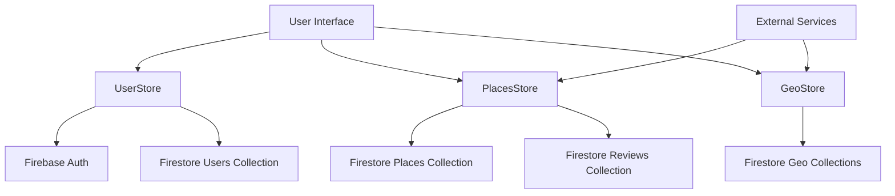

# Dokumentasi Mendalam Firestore Services Musafir

## 1. Implementasi Specific Methods

### A. User Authentication Flow
```dart
class UserStore {
  final FirebaseAuth auth = FirebaseAuth.instance;
  
  Future<UserCredential> signInWithGoogle() async {
    try {
      // 1. Trigger Google Sign In
      final GoogleSignInAccount? googleUser = await GoogleSignIn().signIn();
      
      // 2. Get auth details
      final GoogleSignInAuthentication? googleAuth = await googleUser?.authentication;
      
      // 3. Create credentials
      final credential = GoogleAuthProvider.credential(
        accessToken: googleAuth?.accessToken,
        idToken: googleAuth?.idToken,
      );
      
      // 4. Sign in and create/update user document
      final userCredential = await auth.signInWithCredential(credential);
      await _createOrUpdateUserDocument(userCredential.user);
      
      return userCredential;
    } catch (e) {
      throw CustomAuthException('Failed to sign in with Google: $e');
    }
  }

  Future<void> _createOrUpdateUserDocument(User? user) async {
    if (user == null) return;
    
    final userDoc = await dbUsers.doc(user.email).get();
    
    if (!userDoc.exists) {
      // Create new user document
      await createUser(
        username: user.displayName,
        email: user.email,
        photoURL: user.photoURL,
        provider: 'google'
      );
    } else {
      // Update last login
      await dbUsers.doc(user.email).update({
        'lastLogin': DateTime.now()
      });
    }
  }
}
```

### B. Places Management System
```dart
class PlacesStore {
  // Kompleks query untuk mengambil tempat dengan berbagai filter
  Future<List<Place>> getFilteredPlaces({
    required int countryId,
    required int cityId,
    int? halalStatus,
    String? category,
    double? minRating,
    int? limit
  }) async {
    try {
      Query query = dbPlaces
          .where("country_id", isEqualTo: countryId)
          .where("city_id", isEqualTo: cityId);
      
      if (halalStatus != null) {
        query = query.where("halal_status", isEqualTo: halalStatus);
      }
      
      if (category != null) {
        query = query.where("category", isEqualTo: category);
      }
      
      if (minRating != null) {
        query = query.where("rating", isGreaterThanOrEqualTo: minRating);
      }
      
      if (limit != null) {
        query = query.limit(limit);
      }
      
      final snapshot = await query.get();
      
      return snapshot.docs.map((doc) => Place.fromFirestore(doc)).toList();
    } catch (e) {
      debugPrint("Error fetching filtered places: $e");
      throw CustomDatabaseException('Failed to fetch places');
    }
  }
}
```

### C. Review System
```dart
class ReviewSystem {
  // Implementasi sistem rating dan review
  Future<void> submitReview({
    required String placeId,
    required String userId,
    required double rating,
    required String review,
    List<String>? photos
  }) async {
    try {
      // 1. Start a new batch
      final batch = FirebaseFirestore.instance.batch();
      
      // 2. Add review document
      final reviewRef = dbReviews.doc();
      batch.set(reviewRef, {
        'placeId': placeId,
        'userId': userId,
        'rating': rating,
        'review': review,
        'photos': photos ?? [],
        'createdAt': DateTime.now(),
        'likes': 0
      });
      
      // 3. Update place's average rating
      final placeRef = dbPlaces.doc(placeId);
      final placeDoc = await placeRef.get();
      final currentData = placeDoc.data() as Map<String, dynamic>;
      
      final currentRating = currentData['rating'] ?? 0.0;
      final reviewCount = currentData['reviewCount'] ?? 0;
      
      final newRating = ((currentRating * reviewCount) + rating) / (reviewCount + 1);
      
      batch.update(placeRef, {
        'rating': newRating,
        'reviewCount': reviewCount + 1
      });
      
      // 4. Commit batch
      await batch.commit();
    } catch (e) {
      throw ReviewException('Failed to submit review: $e');
    }
  }
}
```

## 2. Flow Data Antara Services

### A. Diagram Alur Data


### B. State Management dengan GetX
```dart
class UserController extends GetxController {
  final UserStore _userStore = UserStore();
  final RxBool isLoading = false.obs;
  final Rx<User?> currentUser = Rx<User?>(null);
  
  Future<void> signIn() async {
    try {
      isLoading.value = true;
      final user = await _userStore.signInWithGoogle();
      currentUser.value = user;
    } finally {
      isLoading.value = false;
    }
  }
  
  // Reactive state updates
  Future<void> updateProfile(Map<String, dynamic> data) async {
    try {
      isLoading.value = true;
      await _userStore.updateUserData(data);
      await refreshUserData();
    } finally {
      isLoading.value = false;
    }
  }
  
  Future<void> refreshUserData() async {
    final userData = await _userStore.getUserDetail();
    currentUser.update((user) {
      if (user != null) {
        // Update user properties
        user.updateProfile(userData);
      }
    });
  }
}
```

### C. Data Synchronization
```dart
class DataSyncService {
  final _connectivity = Connectivity();
  final _userStore = UserStore();
  final _placesStore = PlacesStore();
  
  Future<void> syncOfflineData() async {
    if (await _connectivity.checkConnectivity() == ConnectivityResult.none) {
      return;
    }
    
    try {
      // Sync user data
      final offlineChanges = await _getOfflineChanges();
      for (var change in offlineChanges) {
        await _processOfflineChange(change);
      }
      
      // Sync place data
      final offlinePlaces = await _getOfflinePlaces();
      for (var place in offlinePlaces) {
        await _syncPlace(place);
      }
    } catch (e) {
      debugPrint('Error syncing offline data: $e');
    }
  }
}
```

## 3. Security Rules

### A. Firestore Security Rules
```javascript
rules_version = '2';
service cloud.firestore {
  match /databases/{database}/documents {
    // User Profile Rules
    match /users/{userId} {
      allow read: if request.auth != null && request.auth.uid == userId;
      allow write: if request.auth != null && request.auth.uid == userId;
      
      // Validation rules
      function isValidUserData() {
        let data = request.resource.data;
        return data.username is string &&
               data.username.size() >= 3 &&
               data.email is string &&
               data.email.matches('^[A-Za-z0-9._%+-]+@[A-Za-z0-9.-]+\\.[A-Za-z]{2,}$');
      }
    }
    
    // Places Rules
    match /places/{placeId} {
      allow read: if true;
      allow write: if request.auth != null && hasAdminRole();
      
      function hasAdminRole() {
        return get(/databases/$(database)/documents/users/$(request.auth.uid)).data.role == 'admin';
      }
    }
    
    // Reviews Rules
    match /reviews/{reviewId} {
      allow read: if true;
      allow create: if request.auth != null && 
                   request.resource.data.userId == request.auth.uid &&
                   isValidReview();
      allow update, delete: if request.auth != null && 
                          resource.data.userId == request.auth.uid;
                          
      function isValidReview() {
        let data = request.resource.data;
        return data.rating >= 1 && 
               data.rating <= 5 &&
               data.text is string &&
               data.text.size() <= 1000;
      }
    }
  }
}
```

### B. Custom Security Middleware
```dart
class SecurityMiddleware {
  static Future<bool> validateUserPermissions(String userId, String action) async {
    try {
      final userDoc = await FirebaseFirestore.instance
          .collection('users')
          .doc(userId)
          .get();
          
      if (!userDoc.exists) return false;
      
      final userData = userDoc.data()!;
      final userRole = userData['role'] as String?;
      
      switch (action) {
        case 'managePlace':
          return userRole == 'admin' || userRole == 'moderator';
        case 'deleteReview':
          return userRole == 'admin';
        default:
          return false;
      }
    } catch (e) {
      debugPrint('Error validating permissions: $e');
      return false;
    }
  }
}
```

## 4. Integration Patterns dengan UI

### A. Repository Pattern
```dart
abstract class IPlacesRepository {
  Future<List<Place>> getPlaces(int countryId, int cityId);
  Future<Place> getPlaceById(String id);
  Future<void> addPlace(Place place);
  Future<void> updatePlace(Place place);
  Future<void> deletePlace(String id);
}

class FirestorePlacesRepository implements IPlacesRepository {
  final PlacesStore _placesStore;
  
  FirestorePlacesRepository(this._placesStore);
  
  @override
  Future<List<Place>> getPlaces(int countryId, int cityId) async {
    try {
      final snapshot = await _placesStore.placesList(countryId, cityId);
      return snapshot.docs.map((doc) => Place.fromFirestore(doc)).toList();
    } catch (e) {
      throw RepositoryException('Failed to fetch places: $e');
    }
  }
  
  // Implementasi method lainnya...
}
```

### B. View Models
```dart
class PlaceViewModel extends ChangeNotifier {
  final IPlacesRepository _repository;
  List<Place> _places = [];
  bool _isLoading = false;
  String? _error;
  
  PlaceViewModel(this._repository);
  
  List<Place> get places => _places;
  bool get isLoading => _isLoading;
  String? get error => _error;
  
  Future<void> loadPlaces(int countryId, int cityId) async {
    try {
      _isLoading = true;
      notifyListeners();
      
      _places = await _repository.getPlaces(countryId, cityId);
      _error = null;
    } catch (e) {
      _error = e.toString();
    } finally {
      _isLoading = false;
      notifyListeners();
    }
  }
}
```

### C. UI Components Integration
```dart
class PlacesScreen extends StatelessWidget {
  @override
  Widget build(BuildContext context) {
    return ChangeNotifierProvider(
      create: (context) => PlaceViewModel(
        FirestorePlacesRepository(PlacesStore())
      ),
      child: Consumer<PlaceViewModel>(
        builder: (context, viewModel, child) {
          if (viewModel.isLoading) {
            return LoadingIndicator();
          }
          
          if (viewModel.error != null) {
            return ErrorView(
              message: viewModel.error!,
              onRetry: () => viewModel.loadPlaces(1, 1)
            );
          }
          
          return ListView.builder(
            itemCount: viewModel.places.length,
            itemBuilder: (context, index) {
              final place = viewModel.places[index];
              return PlaceCard(place: place);
            }
          );
        }
      )
    );
  }
}
```

## 5. Error Handling Patterns

### A. Custom Exceptions
```dart
// Base exception class
abstract class AppException implements Exception {
  final String message;
  final String? code;
  
  AppException(this.message, [this.code]);
  
  @override
  String toString() => 'AppException: $message ${code != null ? '(Code: $code)' : ''}';
}

// Specific exceptions
class AuthException extends AppException {
  AuthException(String message, [String? code]) : super(message, code);
}

class DatabaseException extends AppException {
  DatabaseException(String message, [String? code]) : super(message, code);
}

class NetworkException extends AppException {
  NetworkException(String message, [String? code]) : super(message, code);
}
```

### B. Error Handler Service
```dart
class ErrorHandler {
  static Future<T> handleFirestoreOperation<T>({
    required Future<T> Function() operation,
    String? context,
  }) async {
    try {
      return await operation();
    } on FirebaseException catch (e) {
      throw DatabaseException(
        'Firebase error ${context != null ? 'while $context' : ''}: ${e.message}',
        e.code
      );
    } catch (e) {
      throw DatabaseException(
        'Unexpected error ${context != null ? 'while $context' : ''}: $e'
      );
    }
  }
  
  static void showErrorDialog(BuildContext context, AppException exception) {
    showDialog(
      context: context,
      builder: (context) => AlertDialog(
        title: Text('Error'),
        content: Text(exception.message),
        actions: [
          TextButton(
            onPressed: () => Navigator.pop(context),
            child: Text('OK'),
          ),
        ],
      ),
    );
  }
}
```

### C. Error Recovery Strategies
```dart
class ErrorRecoveryStrategy {
  static Future<void> handleNetworkError({
    required Future<void> Function() operation,
    required Future<void> Function() onRetry,
    int maxRetries = 3,
    Duration delay = const Duration(seconds: 2),
  }) async {
    int attempts = 0;
    
    while (attempts < maxRetries) {
      try {
        await operation();
        return;
      } on NetworkException catch (e) {
        attempts++;
        if (attempts >= maxRetries) {
          throw NetworkException(
            'Operation failed after $maxRetries attempts: ${e.message}'
          );
        }
        
        await Future.delayed(delay * attempts);
        await onRetry();
      }
    }
  }
  
  static Future<void> handleDatabaseError({
    required Future<void> Function() operation,
    required Future<void> Function(DatabaseException) onError,
    required Future<void> Function() onFallback,
  }) async {
    try {
      await operation();
    } on DatabaseException catch (e) {
      await onError(e);
      await onFallback();
    }
  }
}

### D. Implementasi Error Handling di Repository
```dart
class FirestorePlacesRepository implements IPlacesRepository {
  final PlacesStore _placesStore;
  
  @override
  Future<List<Place>> getPlaces(int countryId, int cityId) async {
    return await ErrorHandler.handleFirestoreOperation(
      operation: () async {
        final snapshot = await _placesStore.placesList(countryId, cityId);
        return snapshot.docs.map((doc) => Place.fromFirestore(doc)).toList();
      },
      context: 'fetching places'
    );
  }
  
  @override
  Future<void> addPlace(Place place) async {
    await ErrorRecoveryStrategy.handleNetworkError(
      operation: () => _placesStore.addPlaceToInternal(place.toMap()),
      onRetry: () async {
        // Lakukan operasi pembersihan jika diperlukan
        await _cleanupIncompleteOperation();
      }
    );
  }
  
  Future<void> _cleanupIncompleteOperation() async {
    // Implementasi logika pembersihan
  }
}

### E. Comprehensive Error Logging
```dart
class ErrorLogger {
  static Future<void> logError({
    required Exception error,
    required String context,
    StackTrace? stackTrace,
    Map<String, dynamic>? additionalData,
  }) async {
    try {
      final errorLog = {
        'timestamp': DateTime.now().toIso8601String(),
        'error': error.toString(),
        'context': context,
        'stackTrace': stackTrace?.toString(),
        'additionalData': additionalData,
        'user': FirebaseAuth.instance.currentUser?.email,
      };
      
      // Log ke Firestore
      await FirebaseFirestore.instance
        .collection('error_logs')
        .add(errorLog);
        
      // Log ke console untuk debugging
      debugPrint('ERROR LOG: ${errorLog.toString()}');
      
    } catch (e) {
      debugPrint('Failed to log error: $e');
    }
  }
}

### F. UI Error Handling Components
```dart
class ErrorView extends StatelessWidget {
  final String message;
  final VoidCallback? onRetry;
  final bool showHomeButton;

  const ErrorView({
    required this.message,
    this.onRetry,
    this.showHomeButton = true,
  });

  @override
  Widget build(BuildContext context) {
    return Center(
      child: Column(
        mainAxisAlignment: MainAxisAlignment.center,
        children: [
          Icon(Icons.error_outline, size: 48, color: Colors.red),
          SizedBox(height: 16),
          Text(
            message,
            textAlign: TextAlign.center,
            style: TextStyle(fontSize: 16),
          ),
          SizedBox(height: 16),
          if (onRetry != null)
            ElevatedButton(
              onPressed: onRetry,
              child: Text('Coba Lagi'),
            ),
          if (showHomeButton)
            TextButton(
              onPressed: () => Navigator.of(context).pushNamedAndRemoveUntil(
                '/',
                (route) => false,
              ),
              child: Text('Kembali ke Beranda'),
            ),
        ],
      ),
    );
  }
}
```

## Penggunaan Best Practices

### 1. Validasi Data
```dart
class DataValidator {
  static bool isValidPlace(Map<String, dynamic> data) {
    return data.containsKey('name') &&
           data.containsKey('address') &&
           data['name'] is String &&
           data['name'].isNotEmpty &&
           data['address'] is String &&
           data['address'].isNotEmpty;
  }
  
  static bool isValidReview(Map<String, dynamic> data) {
    return data.containsKey('rating') &&
           data.containsKey('text') &&
           data['rating'] is num &&
           data['rating'] >= 1 &&
           data['rating'] <= 5 &&
           data['text'] is String &&
           data['text'].length <= 1000;
  }
}
```

### 2. Transaction Management
```dart
class TransactionManager {
  static Future<void> addPlaceWithReview({
    required Place place,
    required Review review,
  }) async {
    final firestore = FirebaseFirestore.instance;
    
    await firestore.runTransaction((transaction) async {
      // 1. Add place
      final placeRef = firestore.collection('places').doc();
      transaction.set(placeRef, place.toMap());
      
      // 2. Add review with reference to place
      final reviewRef = firestore.collection('reviews').doc();
      transaction.set(reviewRef, {
        ...review.toMap(),
        'placeId': placeRef.id,
      });
      
      // 3. Update place with review reference
      transaction.update(placeRef, {
        'reviewIds': FieldValue.arrayUnion([reviewRef.id]),
      });
    });
  }
}
```

### 3. Caching Strategy
```dart
class CacheManager {
  static const cacheDuration = Duration(hours: 1);
  final _cache = <String, CacheEntry>{};
  
  Future<T> getCachedData<T>({
    required String key,
    required Future<T> Function() fetchData,
  }) async {
    if (_cache.containsKey(key)) {
      final entry = _cache[key]!;
      if (!entry.isExpired) {
        return entry.data as T;
      }
    }
    
    final data = await fetchData();
    _cache[key] = CacheEntry(
      data: data,
      timestamp: DateTime.now(),
    );
    
    return data;
  }
}

class CacheEntry {
  final dynamic data;
  final DateTime timestamp;
  
  CacheEntry({
    required this.data,
    required this.timestamp,
  });
  
  bool get isExpired =>
    DateTime.now().difference(timestamp) > CacheManager.cacheDuration;
}