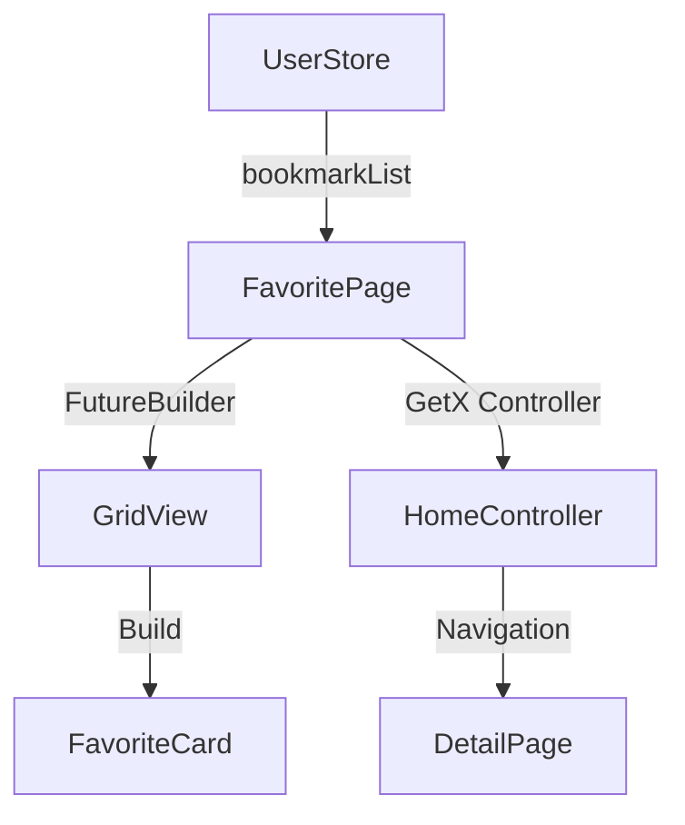

# Deep Dive Technical Documentation - FavoritePage

## Analisis Mendalam State Management

### 1. StatefulWidget Implementation
```dart
class FavoritePage extends StatefulWidget {
  const FavoritePage({super.key});

  @override
  State<FavoritePage> createState() => _FavoritePageState();
}
```

**Analisis Mendalam:**
- Penggunaan StatefulWidget dipilih karena:
  - Perlu mengelola state Future untuk data favorit
  - Memungkinkan refresh data tanpa rebuild seluruh widget tree
  - Mempertahankan state saat navigasi
  - Memungkinkan implementasi lifecycle methods jika diperlukan

**Lifecycle Events yang Dapat Diimplementasikan:**
```dart
@override
void initState() {
  super.initState();
  // Initialize favorite future
  _loadFavorites();
}

@override
void dispose() {
  // Clean up resources
  super.dispose();
}
```

### 2. Future Management
```dart
Future favorite = UserStore().bookmarkList().then((value) {
  if (value != null) {
    return value['place'];
  } else {
    return null;
  }
});
```

**Analisis Teknis:**
1. **Memory Management:**
   - Future tidak di-cache
   - Setiap rebuild akan membuat Future baru
   - Potensi memory leak jika tidak dihandle dengan baik

2. **Optimisasi yang Bisa Dilakukan:**
```dart
late Future<List<Map<String, dynamic>>> _favoriteFuture;

@override
void initState() {
  super.initState();
  _favoriteFuture = _initializeFavorite();
}

Future<List<Map<String, dynamic>>> _initializeFavorite() async {
  final result = await UserStore().bookmarkList();
  return result?['place'] ?? [];
}
```

### 3. Data Flow Architecture



## Analisis Mendalam Komponen UI

### 1. Grid Layout System
```dart
GridView.builder(
  gridDelegate: const SliverGridDelegateWithMaxCrossAxisExtent(
    maxCrossAxisExtent: 206,
    mainAxisExtent: 190,
    crossAxisSpacing: 15,
    mainAxisSpacing: 15,
  ),
)
```

**Kalkulasi Layout:**
- Dengan maxCrossAxisExtent 206:
  - Pada layar 360dp: 1 kolom
  - Pada layar 411dp: 2 kolom
  - Pada layar 768dp: 3 kolom
  - Pada layar 1024dp: 4 kolom

**Formula Perhitungan Kolom:**
```dart
int calculateColumns(double screenWidth) {
  return (screenWidth / (206 + 15)).floor();
}
```

### 2. Loading State Management
```dart
if (snapshot.connectionState == ConnectionState.done) {
  // Render content
} else {
  return const SkeletonCardRekomendasi();
}
```

**Optimisasi Loading State:**
```dart
Widget _buildLoadingState() {
  return GridView.builder(
    // Same grid delegate as content
    itemBuilder: (context, index) => const SkeletonCardRekomendasi(),
    itemCount: 6, // Tampilkan 6 skeleton cards
  );
}
```

## Analisis Mendalam Performa

### 1. Memory Footprint

**Potential Memory Leaks:**
1. Future yang tidak dibatalkan
2. GetX controller yang tidak di-dispose
3. Image caching dari URL foto

**Optimisasi:**
```dart
class _FavoritePageState extends State<FavoritePage> {
  late StreamController<List<Map<String, dynamic>>> _favoriteController;
  
  @override
  void initState() {
    super.initState();
    _favoriteController = StreamController();
    _loadData();
  }
  
  @override
  void dispose() {
    _favoriteController.close();
    super.dispose();
  }
  
  Future<void> _loadData() async {
    try {
      final data = await UserStore().bookmarkList();
      if (!_favoriteController.isClosed) {
        _favoriteController.add(data?['place'] ?? []);
      }
    } catch (e) {
      if (!_favoriteController.isClosed) {
        _favoriteController.addError(e);
      }
    }
  }
}
```

### 2. Network Optimization

**Current Implementation:**
- Loads all images at once
- No image caching strategy
- No progressive loading

**Optimized Implementation:**
```dart
class OptimizedFavoriteCard extends StatelessWidget {
  final String imageUrl;
  
  Widget _buildOptimizedImage() {
    return CachedNetworkImage(
      imageUrl: '${AppConstans.PLACE_PHOTO}$imageUrl',
      placeholder: (context, url) => const ShimmerLoader(),
      errorWidget: (context, url, error) => const Icon(Icons.error),
      memCacheWidth: 206, // Match grid width
      memCacheHeight: 190, // Match grid height
    );
  }
}
```

## Analisis Mendalam Error Handling

### 1. Error Boundaries

**Implementation Error Handling:**
```dart
class FavoriteErrorBoundary extends StatelessWidget {
  final Widget child;
  
  @override
  Widget build(BuildContext context) {
    return ErrorBoundary(
      onError: (error, stack) {
        return Center(
          child: Column(
            children: [
              Text('Terjadi kesalahan saat memuat data'),
              ElevatedButton(
                onPressed: () => _retryLoading(),
                child: Text('Coba Lagi'),
              ),
            ],
          ),
        );
      },
      child: child,
    );
  }
}
```

### 2. Network Error Handling

```dart
Future<void> _loadFavorites() async {
  try {
    final result = await UserStore().bookmarkList();
    if (mounted) {
      setState(() {
        favorite = Future.value(result?['place']);
      });
    }
  } on NetworkException catch (e) {
    _showNetworkError();
  } on TimeoutException catch (e) {
    _showTimeoutError();
  } catch (e) {
    _showGeneralError();
  }
}
```

## Deep Dive: GetX Integration

### 1. Controller Management

```dart
class FavoriteBinding extends Bindings {
  @override
  void dependencies() {
    Get.lazyPut(() => HomeController());
  }
}
```

### 2. Navigation Flow

```dart
void _navigateToDetail(Map<String, dynamic> item) {
  final controller = Get.find<HomeController>();
  
  // Pre-load data
  controller.placeDetail(item['place_id']).then((_) {
    // Navigate after data is loaded
    Get.toNamed(
      RouteHelper.getHomeDetailPage(
        item['place_id'],
        item['place_name'],
        'favorite',
        item['type'],
      ),
    );
  }).catchError((error) {
    // Handle navigation error
    Get.snackbar('Error', 'Gagal memuat detail tempat');
  });
}
```

## Security Considerations

### 1. Data Validation
```dart
bool _validatePlaceData(Map<String, dynamic> place) {
  return place.containsKey('place_id') &&
         place.containsKey('place_name') &&
         place.containsKey('address') &&
         place.containsKey('photo') &&
         place.containsKey('type');
}
```

### 2. URL Sanitization
```dart
String _sanitizeImageUrl(String url) {
  final sanitized = url.replaceAll(RegExp(r'[<>"]'), '');
  if (!sanitized.startsWith('https://')) {
    return AppConstans.DEFAULT_PHOTO;
  }
  return sanitized;
}
```

## Testing Strategy

### 1. Widget Tests
```dart
void main() {
  testWidgets('FavoritePage shows loading state', (WidgetTester tester) async {
    await tester.pumpWidget(MaterialApp(home: FavoritePage()));
    expect(find.byType(SkeletonCardRekomendasi), findsWidgets);
  });
}
```

### 2. Integration Tests
```dart
void main() {
  IntegrationTestWidgetsFlutterBinding.ensureInitialized();

  testWidgets('Full favorite flow test', (WidgetTester tester) async {
    await tester.pumpWidget(MyApp());
    
    // Navigate to favorite
    await tester.tap(find.byIcon(Icons.favorite));
    await tester.pumpAndSettle();
    
    // Verify grid appears
    expect(find.byType(GridView), findsOneWidget);
    
    // Tap on first item
    await tester.tap(find.byType(FavoriteCard).first);
    await tester.pumpAndSettle();
    
    // Verify navigation
    expect(find.byType(DetailPage), findsOneWidget);
  });
}
```

## Maintenance dan Scaling

### 1. Code Modularity
- Pisahkan logic ke dalam services
- Gunakan repository pattern
- Implementasi dependency injection

### 2. Performance Monitoring
```dart
class PerformanceMonitor {
  static void trackPageLoad() {
    final stopwatch = Stopwatch()..start();
    
    return () {
      stopwatch.stop();
      print('Page load time: ${stopwatch.elapsedMilliseconds}ms');
    };
  }
}
```

### 3. Scaling Considerations
- Implementasi pagination untuk data yang besar
- Caching strategy untuk gambar
- Lazy loading untuk konten
- State management yang efisien

## Rekomendasi Pengembangan Lanjutan

1. **Implementasi Refresh Mechanism:**
```dart
RefreshIndicator(
  onRefresh: () async {
    setState(() {
      favorite = UserStore().bookmarkList().then((value) => value?['place']);
    });
  },
  child: listCard(),
)
```

2. **Offline Support:**
```dart
class OfflineFavoriteRepository {
  final Box<Map> _box;
  
  Future<void> cacheFavorites(List<Map<String, dynamic>> favorites) async {
    await _box.put('favorites', favorites);
  }
  
  Future<List<Map<String, dynamic>>> getCachedFavorites() async {
    return _box.get('favorites', defaultValue: []);
  }
}
```

3. **Analytics Integration:**
```dart
class FavoriteAnalytics {
  static void trackFavoriteView(String placeId) {
    FirebaseAnalytics.instance.logEvent(
      name: 'view_favorite',
      parameters: {
        'place_id': placeId,
      },
    );
  }
}
```